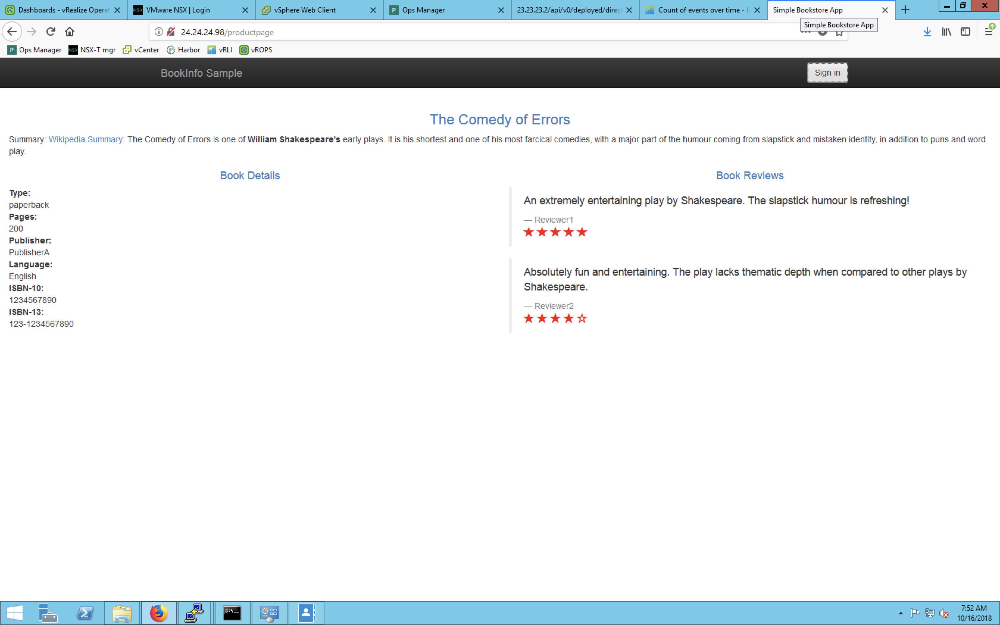

# Installing Istio in New Kubernetes Clusters Created by PKS with NSX-T Using Helm

This topic describes how to install [Istio](https://istio.io/) in a new Kubernetes cluster created by Pivotal Container Service (PKS) with NSX-T using Helm.

Helm is the package manager for Kubernetes that runs on a local machine with kubectl access to the Kubernetes cluster. For more information, see [Using Helm with PKS](./helm.html).

The installation process for Istio involves creating a Helm template from the downloaded Istio files. For more information, see [Installation with Helm](https://istio.io/docs/setup/kubernetes/helm-install/) in the Istio documentation.

These instructions are intended for using Istio for the service mesh layer for **new** Kubernetes clusters, not for retrofitting clusters with pods that currently exist.

**Note:** Using [Tiller with Helm Install](https://istio.io/docs/setup/kubernetes/helm-install/#option-2-install-with-helm-and-tiller-via-helm-instal) is not recommended at this time.

## Prerequisites

Before performing the procedures in this topic, you must have installed and configured the following:

- PKS v1.2+
- NSX-T v2.3+
- A PKS plan with at least 1 master and 2 worker nodes

## Install Istio

Perform the procedures in the sections below to install Istio on a new Kubernetes cluster created by PKS with NSX-T using Helm.

### Step 1: Create a New PKS Cluster

Perform the following steps to create a new PKS cluster that uses a medium load balancer:

1. Ensure that you have defined a network profile that implements a medium load balancer so that there are enough virtual servers and ports. For more information, see [Using Network Profiles (NSX-T Only)](https://docs.pivotal.io/runtimes/pks/1-2/network-profiles.html).
2. Log in to the PKS CLI.
3. Run the following command to create a cluster:

	```
	pks create-cluster CLUSTER-NAME \
	--external-hostname HOSTNAME \
	--plan PLAN-NAME \
	--num-nodes 3 \
	--network-profile NETWORK-PROFILE-NAME
	```
	Where:
	* `CLUSTER-NAME` is a unique name for your new cluster.
	* `HOSTNAME` is your external hostname used for accessing the Kubernetes API.
	* `PLAN-NAME` is the name of your PKS plan with at least 1 master and 2 worker nodes.
	* `NETWORK-PROFILE-NAME` is the name of the network profile you created that implements a medium load balancer.

	For example:
  	```
	$ pks create-cluster k8s-with-istio \
	--external-hostname k8s-with-istio \
	--plan large \
	--num-nodes 3 \
	--network-profile network-profile-medium
	```
	For more information about creating clusters, see [Creating Clusters](https://docs.pivotal.io/runtimes/pks/1-2/create-cluster.html).

4. Run the following command to populate your local `kubeconfig` with cluster credentials and configuration so that you can use kubectl:

	```
	pks get-credentials CLUSTER-NAME
	```
	Where `CLUSTER-NAME` is the name of your new cluster. For example:
	```
	$ pks-cluster-med-lb-istio
	```

### Step 2: Download Istio and Helm

Perform the following steps to download Istio and Helm onto the machine with kubectl access to the Kubernetes cluster:

1. Run the following command to download Istio:

	```
	curl -L https://git.io/getLatestIstio | sh -
	```
2. Change into the directory of the downloaded Istio package.
3. Run the following command to put the `istioctl` command line tool in your `PATH`:

	```
	export PATH=$PWD/bin:$PATH
	```

4. Run the following command to download Helm:

	```
	curl https://raw.githubusercontent.com/kubernetes/helm/master/scripts/get | bash
	```

### Step 3: Install Kubernetes CRDs

Run the following command to install Istio’s Custom Resource Definitions (CRDs):   

```
kubectl apply -f install/kubernetes/helm/istio/templates/crds.yaml
```

Wait a few seconds for the CRDs to be committed in the kube-apiserver.

### Step 4: Create and Install Helm Template

Run the following command to render Istio’s core components to a Kubernetes manifest called `istio.yaml`:

```
helm template install/kubernetes/helm/istio --name istio --namespace istio-system > $HOME/istio.yaml
```

### Step 5: Install Istio Using the Helm Manifest

Perform the following commands to create a namespace and install Istio via the Helm manifest:

```
kubectl create namespace istio-system
kubectl apply -f $HOME/istio.yaml
```

## Verify Istio Installation

Perform the procedures in the following sections to verify the installation of Istio on PKS with NSX-T.

### Step 1: Ensure Services Are Deployed

Perform the following steps to ensure the correct services are deployed:

1. Run the following command to display the Kubernetes services in the Istio namespace:

	```
	kubectl get svc -n istio-system
	```

2. Ensure the following Kubernetes services are deployed:
	* `istio-pilot`
	* `istio-ingressgateway`
	* `istio-policy`
	* `istio-telemetry`
	* `prometheus`
	* `istio-galley`
	* `istio-sidecar-injector` (optional)


### Step 2: Ensure Pods Are Running

Perform the following steps to ensure the correct pods are running:

1. Run the following command to display the pods in the Istio namespace:

	```
	kubectl get pods -n istio-system
	```

1. Ensure the Kubernetes pods corresponding to the services are deployed and that all containers are up and running:
	* `istio-pilot-*`
	* `istio-ingressgateway-*`
	* `istio-egressgateway-*`
	* `istio-policy-*`
	* `istio-telemetry-*`
	* `istio-citadel-*`
	* `prometheus-*`
	* `istio-galley-*`
	* `istio-sidecar-injector-*` (optional)


## Deploy Test Application

After installing Istio and verifying the installation, you can deploy a test application.

The [Bookinfo application](https://istio.io/docs/examples/bookinfo/) is a standard testing application to verify a successful deployment.

### Step 1: Deploy the Bookinfo Application

Perform the following steps to deploy the Bookinfo application:

1. The installation already has automatic sidecar injection enabled on the cluster. Our application is going to be using the `default` namespace. This requires the label `istio-injection=enabled` be applied to the `default` namespace. Run the following command:

	```
	kubectl label namespace default istio-injection=enabled
	```

2. Deploy the services. Run the following command:

	```
	kubectl apply -f samples/bookinfo/platform/kube/bookinfo.yaml
	```

3. Confirm all services and pods are correctly defined and running. Run the following commands to display the services and the pods:

	```
	kubectl get services

	NAME                       CLUSTER-IP   EXTERNAL-IP   PORT(S)              AGE
    details                    10.0.0.31    <none>        9080/TCP             6m
    kubernetes                 10.0.0.1     <none>        443/TCP              7d
    productpage                10.0.0.120   <none>        9080/TCP             6m
    ratings                    10.0.0.15    <none>        9080/TCP             6m
    reviews                    10.0.0.170   <none>        9080/TCP             6m

	kubectl get pods

	NAME                                        READY     STATUS    RESTARTS   AGE
    details-v1-1520924117-48z17                 2/2       Running   0          6m
    productpage-v1-560495357-jk1lz              2/2       Running   0          6m
    ratings-v1-734492171-rnr5l                  2/2       Running   0          6m
    reviews-v1-874083890-f0qf0                  2/2       Running   0          6m
    reviews-v2-1343845940-b34q5                 2/2       Running   0          6m
    reviews-v3-1813607990-8ch52                 2/2       Running   0          6m
	```

### Step 2: Configure Ingress

Now that the Bookinfo services are running, you must make the application accessible outside of your Kubernetes cluster with an Istio gateway.

Since PKS uses NSX-T, you use load balancers instead of NodePort.

Perform the following steps to configure the ingress:

1. Define the ingress gateway for the application. Run the following command:

	```
	kubectl apply -f samples/bookinfo/networking/bookinfo-gateway.yaml
	```

2. Confirm that the gateway has been created. Run the following command:

	```
	kubectl get gateway
	```

	In the output, look for `bookinfo-gateway`. For example:
	```
	NAME               AGE
	bookinfo-gateway   32s
	```

3. Run the following command to determine the NSX-T external load balancer IP and service ports:

	```
	kubectl get svc istio-ingressgateway -n istio-system
	```

	The output resembles the following:

	```
	NAME                   TYPE           CLUSTER-IP       EXTERNAL-IP                PORT(S)                                                                                                                   AGE
	istio-ingressgateway   LoadBalancer   10.100.200.220   100.64.80.23,24.24.24.98   80:31380/TCP,443:31390/TCP,31400:31400/TCP,15011:30230/TCP,8060:30211/TCP,853:32055/TCP,15030:30556/TCP,15031:31751/TCP   1h
	```

4. Run the following commands to set the ingress IP and ports:

	```
	export INGRESS_HOST=$(kubectl -n istio-system get service istio-ingressgateway -o jsonpath='{.status.loadBalancer.ingress[0].ip}')
	export INGRESS_PORT=$(kubectl -n istio-system get service istio-ingressgateway -o jsonpath='{.spec.ports[?(@.name=="http2")].port}')
	export SECURE_INGRESS_PORT=$(kubectl -n istio-system get service istio-ingressgateway -o jsonpath='{.spec.ports[?(@.name=="https")].port}')
	```

5. Run the following command to set the gateway URL:

	```
	export GATEWAY_URL=$INGRESS_HOST:$INGRESS_PORT
	```

### Step 3: Confirm Application Is Running

To confirm that the Bookinfo application is running, run the following command:

```
curl -o /dev/null -s -w "%{http_code}\n" http://${GATEWAY_URL}/productpage
200
```

You can point your browser to `http://$GATEWAY_URL/productpage` to view the Bookinfo web page.

If you refresh the page several times, you should see different versions of reviews shown in the product page, presented in a round robin style (red stars, black stars, no stars). See the following screenshot for an example:



## Uninstall Istio

Perform the following steps to uninstall Istio:

1. Delete Istio with the following command:

	```
	kubectl delete -f $HOME/istio.yaml
	```

2. Delete the CRDs with the following command:

	```
	kubectl delete -f install/kubernetes/helm/istio/templates/crds.yaml -n istio-system
	```
