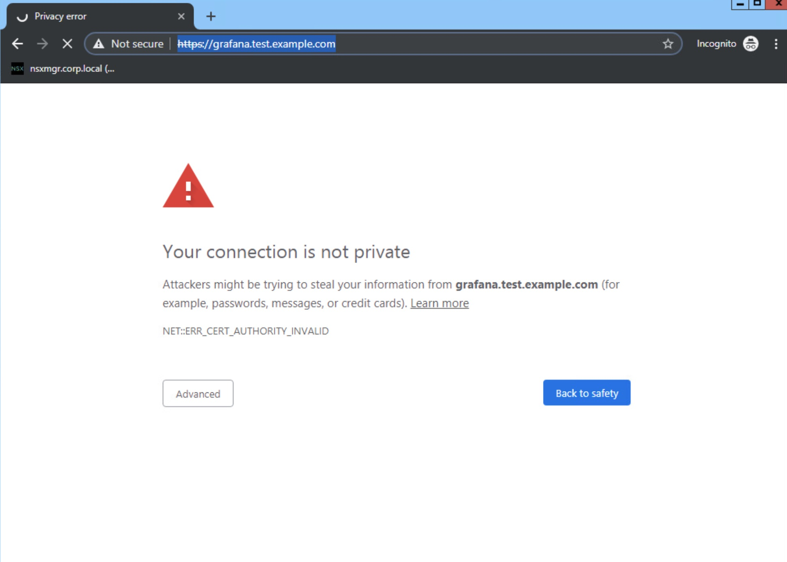
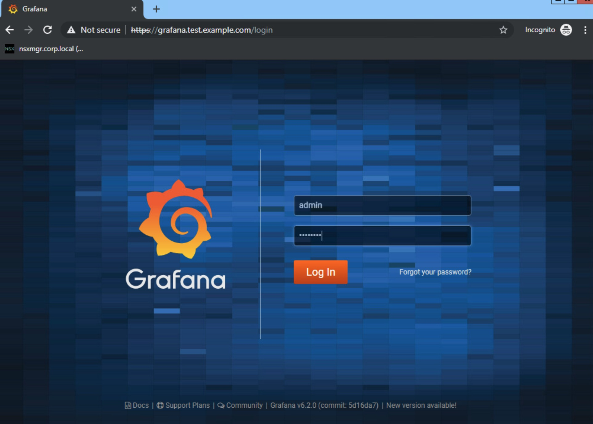
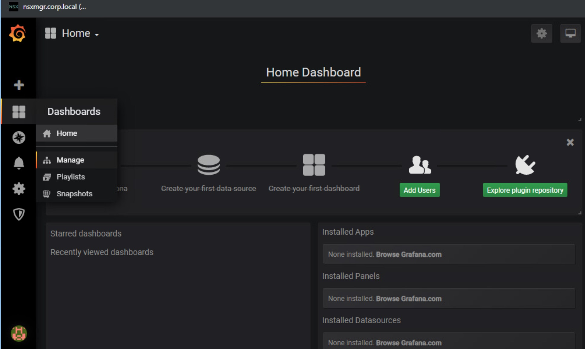
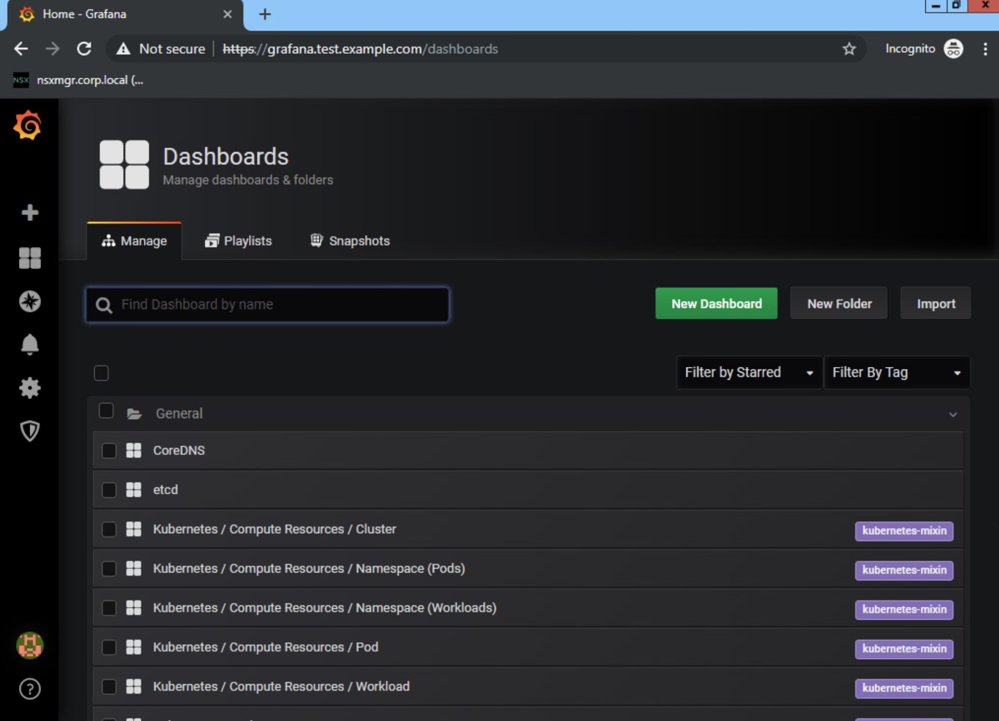
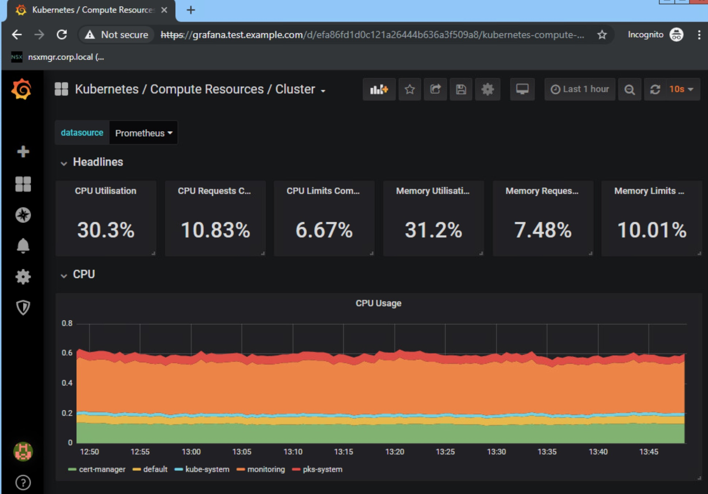

# Installing Prometheus in a Kubernetes Cluster created by PKS with NSX-T Using Helm
This topic describes how to install [Prometheus](https://prometheus.io/) in a Kubernetes cluster created by PKS with NSX-T using Helm. Prometheus is
an open-source monitoring system with a dimensional data model, flexible query language, efficient time series database and modern alerting approach. See https://prometheus.io/ for reference.

There are multiple installation techniques for various scenarios. The goal of this guide is to focus on monitoring a single Kubernetes cluster. The optimal approach is using the Helm package manager to deploy Prometheus utilizing the Operator Framework. Reference: https://github.com/helm/charts/tree/master/stable/prometheus-operator

## Prerequisites:
Before performing the procedure in this topic, you must have installed and configured the following:

* This require DNS name resolutions.
* PKS v1.2+ (Currently tested against PKS v1.4)
* NSX-T v2.3+
* A Kubernetes cluster created with PKS with at least 1 master and 1 worker nodes

## Kubernetes StorageClass
Ensure there is a storage class created with the name 'default', this storage class will be used by the Persistent Volume Claims needed for the Stateful Sets.

This example uses the vSphere driver. To add the necessary storage class, create a file named `storageclass.yaml` by adding the following section:
```yaml
kind: StorageClass
apiVersion: storage.k8s.io/v1
metadata:
  name: default
  annotations:
    storageclass.kubernetes.io/is-default-class: "true"
provisioner: kubernetes.io/vsphere-volume
parameters:
  diskformat: thin  
```

Apply the configuration:

```
kubectl apply -f storageclass.yaml
```

## Install Helm and Tiller

Helm is the package manager for Kubernetes that runs on a local machine with `kubectl` access to the Kubernetes cluster. The installation process for Prometheus and the Certificate Manager leverage Helm charts available on the public Helm repo. Please review the steps on your own recommended way of [Installing Helm](https://helm.sh/docs/using_helm/#installing-helm). For more information, see [Using Helm with PKS](https://docs.pivotal.io/runtimes/pks/1-3/helm.html).

### Install Helm
* Download and install the [Helm CLI](https://github.com/helm/helm/releases) on the local machine that will be interfacing with the Kubernetes cluster. The following Helm Installation is pulling a script and installing without any verification. Use at your discretion:

```
curl -L https://git.io/get_helm.sh | bash
```

### Deploy Tiller

Create a service account for Tiller and bind it to the cluster-admin role. Copy the following into a file named `rbac-config.yaml`

```yaml
apiVersion: v1
kind: ServiceAccount
metadata:
  name: tiller
  namespace: kube-system
---
apiVersion: rbac.authorization.k8s.io/v1beta1
kind: ClusterRoleBinding
metadata:
  name: tiller
roleRef:
  apiGroup: rbac.authorization.k8s.io
  kind: ClusterRole
  name: cluster-admin
subjects:
  - kind: ServiceAccount
    name: tiller
    namespace: kube-system
 ```

  * Apply the configuration using the following command:

  ```
kubectl apply -f rbac-config.yaml
  ```

  * Alternatively, you can use:

  ```
kubectl create serviceaccount --namespace kube-system tiller`
kubectl create clusterrolebinding tiller-clusterrolebinding --clusterrole=cluster-admin --serviceaccount=kube-system:tiller
  ```

Initialize Helm using the service account by running the following command:

```
helm init --skip-refresh --upgrade --service-account tiller`
```

**Note**: For added security, enable SSL between [Helm and Tiller](https://docs.helm.sh/using_helm/#using-ssl-between-helm-and-tiller).

## Certificate Manager

The cert-manager is a native Kubernetes certificate management controller.  The cert-manager can help with issuing certificates and will ensure certificates are valid and up to date; it will also attempt to renew certificates at a configured time before expiry. The documentation is available [here](https://docs.cert-manager.io/en/latest/). We will be following the [Helm based installation](https://docs.cert-manager.io/en/latest/getting-started/install/kubernetes.html#installing-with-helm). At the time of this writing, v0.8 is the latest stable.


  1. Install the CustomResourceDefinition resources separately

  ```
kubectl apply -f https://raw.githubusercontent.com/jetstack/cert-manager/release-0.8/deploy/manifests/00-crds.yaml`
  ```

  2. Create the namespace for cert-manager

  ```
kubectl create namespace cert-manager
  ```

  3. Label the cert-manager namespace to disable resource validation

  ```
kubectl label namespace cert-manager certmanager.k8s.io/disable-validation=true
  ```

  4. Add the Jetstack Helm repository

  ```
helm repo add jetstack https://charts.jetstack.io
  ```

  5. Update your local Helm chart repository cache

  ```
helm repo update
  ```

  6. Deploy the cert-manager Helm chart

  ```
helm install \
--name cert-manager \
--namespace cert-manager \
--version v0.8.1 \
jetstack/cert-manager
  ```

  7. Promethus components will be deployed in the monitoring namespace. Pre-create a monitoring namespace:

  ```
kubectl create namespace monitoring
  ```

  8. Generate cert and upload as secret into your PKS cluster (scoped to a namespace).  

    1. Generate a signing key pair

            openssl genrsa -out ca.key 2048

    2. Create a self signed Certificate

            COMMON_NAME=example.com
            openssl req -x509 -new -nodes -key ca.key \
            -subj "/CN=${COMMON_NAME}" -days 3650 \
            -reqexts v3_req -extensions v3_ca -out ca.crt

    3. Store cert in a Kubernetes Secret resource.

            kubectl create secret tls ca-key-pair \
            --cert=ca.crt \
            --key=ca.key \
            --namespace=monitoring

  **Note**: Issuer can be namespace scoped (`kind: Issuer`) or cluster scoped (`kind: ClusterIssuer`). We will use namespace scoped issuer in this example.

  **Note**: The sample above is provided as an example only.  You should follow your enterprise processes for Certificate management or adapt to use a CA like [Let's Encrypt](https://docs.cert-manager.io/en/latest/tasks/issuers/setup-acme/index.html).   

  9. To create a certificate issuer, copy / paste the YAML sample below in a file named `issuer.yaml`.

```yaml
apiVersion: certmanager.k8s.io/v1alpha1
kind: Issuer
metadata:
  name: ca-issuer
  namespace: monitoring
spec:
  ca:
    secretName: ca-key-pair
```

  10. Apply the configuration with:

  ```
kubectl create -f issuer.yaml
  ```

  11. In order to obtain a Certificate, create a Certificate resource in the same namespace as the Issuer.  In this example, the Issuer is a namespaced resource.  To obtain a signed Certificate, copy / paste the following into a file named `desired-cert.yaml`.

```yaml
apiVersion: certmanager.k8s.io/v1alpha1
kind: Certificate
metadata:
  name: example-com
  namespace: monitoring
spec:
  secretName: example-com-tls
  issuerRef:
    name: ca-issuer
    # We can reference ClusterIssuers by changing the kind here.
    # The default value is Issuer (i.e. a locally namespaced Issuer)
    kind: Issuer
  commonName: example.com
  organization:
  - VMware
  dnsNames:
  - example.com
```

  * Apply the configuration with:

         kubectl create -f desired-cert.yaml

**Note**: The sample above is provided as an example only.  You should follow your enterprise processes for Certificate management.

**Note**: The namespace you use will be based on design requirements. We are using the `default` namespace in this example as this namespace is available in all PKS deployments.   

**Note**: `secretName` in the certificate request will be referenced by the ingress controller.

### Certificate Manager Validation

Verify your installation was successful:

```
root@cli-vm:~/app# kubectl get pod -n cert-manager
NAME                                       READY   STATUS    RESTARTS   AGE
cert-manager-578fc6ff6-ss2r4               1/1     Running   0          39s
cert-manager-cainjector-5975fd64c5-gbtn7   1/1     Running   0          39s
cert-manager-webhook-5c7f95fd44-r7lcr      1/1     Running   0          39s
```

Confirm self-signed and signed certificates are loaded in key store:

```
root@cli-vm:~/app# kubectl get secret -n monitoring | grep kubernetes.io/tls
ca-key-pair                                        kubernetes.io/tls                     2         1d
example-com-tls                                    kubernetes.io/tls                     3         1d
root@cli-vm:~/app#
```

Retrieve the signed TLS key pair:

```
root@cli-vm:~/app#kubectl get secret example-com-tls -n monitoring -o yaml
```

## Prometheus

### Pre-Configuration

To leverage persistent volumes for metrics and expose the Grafana service to external users using an ingress controller, with SSL termination for added security, the Prometheus deployment needs to be customized. cert-manager will issue and maintain the certificate required by the ingress controller. Core Prometheus services will not be externally accessible unless explicit port forwarding is enabled. Copy the following into a file and named `custom.yaml`:

```yaml
alertmanager:
  alertmanagerSpec:
    storage:
      volumeClaimTemplate:
        spec:
          accessModes: ["ReadWriteOnce"]
          resources:
            requests:
              storage: 20Gi

prometheus:
  prometheusSpec:
    storage:
      volumeClaimTemplate:
        spec:
          accessModes: ["ReadWriteOnce"]
          resources:
            requests:
              storage: 20Gi

grafana:
  adminPassword: "VMware1!"
  ingress:
    enabled: true
    annotations:
      kubernetes.io/ingress.class: nginx
      certmanager.k8s.io/issuer: ca-issuer
      kubernetes.io/tls-acme: "true"
    hosts:
      - grafana.test.example.com
    tls:
      - secretName: example-com-tls
        hosts:
          - grafana.test.example.com
  persistence:
    enabled: true
    accessModes: ["ReadWriteOnce"]
    size: 20Gi
```

**Note**: `secretName` must match the name specified in the certificate signing request. See `desired-cert.yaml` from prior steps.

### Deploy NGINX Ingress

Install a nginx ingress controller using helm. This is going to be ingress access to the Grafana dashboard. This controller is of `Type: LoadBalancer` so it will pull an IP address from the allocated range in NSX-T.

```
helm install stable/nginx-ingress --name nginx
```

### Deploy Promethus

Deploy Promethus components in the monitoring namespace.

```
helm install stable/prometheus-operator --name prometheus --namespace monitoring -f custom.yaml
```

  * A successful installation will look like:

  ```
  NAME:   prometheus
  LAST DEPLOYED: Thu Jul 11 09:49:51 2019
  NAMESPACE: monitoring
  STATUS: DEPLOYED

  RESOURCES:
  ==> v1/Alertmanager
  NAME                                     AGE
  prometheus-prometheus-oper-alertmanager  1s

  ==> v1/ClusterRole
  NAME                                       AGE
  prometheus-grafana-clusterrole             2s
  prometheus-prometheus-oper-alertmanager    2s
  prometheus-prometheus-oper-operator        2s
  prometheus-prometheus-oper-operator-psp    2s
  prometheus-prometheus-oper-prometheus      2s
  prometheus-prometheus-oper-prometheus-psp  2s
  psp-prometheus-kube-state-metrics          2s

  ==> v1/ClusterRoleBinding
  NAME                                       AGE
  prometheus-grafana-clusterrolebinding      2s
  prometheus-prometheus-oper-alertmanager    2s
  prometheus-prometheus-oper-operator        2s
  prometheus-prometheus-oper-operator-psp    2s
  prometheus-prometheus-oper-prometheus      2s
  prometheus-prometheus-oper-prometheus-psp  2s
  psp-prometheus-kube-state-metrics          2s

  ==> v1/ConfigMap
  NAME                                                          DATA  AGE
  prometheus-grafana                                            1     2s
  prometheus-grafana-config-dashboards                          1     2s
  prometheus-grafana-test                                       1     2s
  prometheus-prometheus-oper-etcd                               1     2s
  prometheus-prometheus-oper-grafana-datasource                 1     2s
  prometheus-prometheus-oper-k8s-cluster-rsrc-use               1     2s
  prometheus-prometheus-oper-k8s-coredns                        1     2s
  prometheus-prometheus-oper-k8s-node-rsrc-use                  1     2s
  prometheus-prometheus-oper-k8s-resources-cluster              1     2s
  prometheus-prometheus-oper-k8s-resources-namespace            1     2s
  prometheus-prometheus-oper-k8s-resources-pod                  1     2s
  prometheus-prometheus-oper-k8s-resources-workload             1     2s
  prometheus-prometheus-oper-k8s-resources-workloads-namespace  1     2s
  prometheus-prometheus-oper-nodes                              1     2s
  prometheus-prometheus-oper-persistentvolumesusage             1     2s
  prometheus-prometheus-oper-pods                               1     2s
  prometheus-prometheus-oper-statefulset                        1     2s

  ==> v1/Deployment
  NAME                                 READY  UP-TO-DATE  AVAILABLE  AGE
  prometheus-kube-state-metrics        0/1    1           0          1s
  prometheus-prometheus-oper-operator  0/1    1           0          1s

  ==> v1/PersistentVolumeClaim
  NAME                STATUS  VOLUME                                    CAPACITY  ACCESS MODES  STORAGECLASS  AGE
  prometheus-grafana  Bound   pvc-f6eca714-a3fb-11e9-86b1-005056801da1  20Gi      RWO           default       2s

  ==> v1/Pod(related)
  NAME                                                  READY  STATUS             RESTARTS  AGE
  prometheus-grafana-75f646d87b-8597r                   0/2    Init:0/2           0         1s
  prometheus-kube-state-metrics-7fbb4697c-2hwjl         0/1    ContainerCreating  0         1s
  prometheus-prometheus-node-exporter-7dnt2             0/1    ContainerCreating  0         1s
  prometheus-prometheus-node-exporter-c2r5t             0/1    ContainerCreating  0         2s
  prometheus-prometheus-node-exporter-sl6w6             0/1    ContainerCreating  0         1s
  prometheus-prometheus-oper-operator-6d875fb8b5-2tcf9  0/1    ContainerCreating  0         1s

  ==> v1/Prometheus
  NAME                                   AGE
  prometheus-prometheus-oper-prometheus  1s

  ==> v1/PrometheusRule
  NAME                                                             AGE
  prometheus-prometheus-oper-alertmanager.rules                    1s
  prometheus-prometheus-oper-etcd                                  1s
  prometheus-prometheus-oper-general.rules                         1s
  prometheus-prometheus-oper-k8s.rules                             1s
  prometheus-prometheus-oper-kube-apiserver.rules                  1s
  prometheus-prometheus-oper-kube-prometheus-node-alerting.rules   1s
  prometheus-prometheus-oper-kube-prometheus-node-recording.rules  1s
  prometheus-prometheus-oper-kube-scheduler.rules                  1s
  prometheus-prometheus-oper-kubernetes-absent                     1s
  prometheus-prometheus-oper-kubernetes-apps                       1s
  prometheus-prometheus-oper-kubernetes-resources                  1s
  prometheus-prometheus-oper-kubernetes-storage                    1s
  prometheus-prometheus-oper-kubernetes-system                     1s
  prometheus-prometheus-oper-node-network                          1s
  prometheus-prometheus-oper-node-time                             1s
  prometheus-prometheus-oper-node.rules                            1s
  prometheus-prometheus-oper-prometheus-operator                   1s
  prometheus-prometheus-oper-prometheus.rules                      1s

  ==> v1/Role
  NAME                     AGE
  prometheus-grafana-test  2s

  ==> v1/RoleBinding
  NAME                     AGE
  prometheus-grafana-test  2s

  ==> v1/Secret
  NAME                                                  TYPE    DATA  AGE
  alertmanager-prometheus-prometheus-oper-alertmanager  Opaque  1     2s
  prometheus-grafana                                    Opaque  3     2s

  ==> v1/Service
  NAME                                                TYPE       CLUSTER-IP      EXTERNAL-IP  PORT(S)    AGE
  prometheus-grafana                                  ClusterIP  10.100.200.98   <none>       80/TCP     2s
  prometheus-kube-state-metrics                       ClusterIP  10.100.200.248  <none>       8080/TCP   2s
  prometheus-prometheus-node-exporter                 ClusterIP  10.100.200.39   <none>       9100/TCP   2s
  prometheus-prometheus-oper-alertmanager             ClusterIP  10.100.200.157  <none>       9093/TCP   2s
  prometheus-prometheus-oper-coredns                  ClusterIP  None            <none>       9153/TCP   2s
  prometheus-prometheus-oper-kube-controller-manager  ClusterIP  None            <none>       10252/TCP  2s
  prometheus-prometheus-oper-kube-etcd                ClusterIP  None            <none>       2379/TCP   2s
  prometheus-prometheus-oper-kube-scheduler           ClusterIP  None            <none>       10251/TCP  2s
  prometheus-prometheus-oper-operator                 ClusterIP  10.100.200.150  <none>       8080/TCP   2s
  prometheus-prometheus-oper-prometheus               ClusterIP  10.100.200.213  <none>       9090/TCP   2s

  ==> v1/ServiceAccount
  NAME                                     SECRETS  AGE
  prometheus-grafana                       1        2s
  prometheus-grafana-test                  1        2s
  prometheus-kube-state-metrics            1        2s
  prometheus-prometheus-node-exporter      1        2s
  prometheus-prometheus-oper-alertmanager  1        2s
  prometheus-prometheus-oper-operator      1        2s
  prometheus-prometheus-oper-prometheus    1        2s

  ==> v1/ServiceMonitor
  NAME                                                AGE
  prometheus-prometheus-oper-alertmanager             1s
  prometheus-prometheus-oper-apiserver                1s
  prometheus-prometheus-oper-coredns                  1s
  prometheus-prometheus-oper-grafana                  1s
  prometheus-prometheus-oper-kube-controller-manager  1s
  prometheus-prometheus-oper-kube-etcd                1s
  prometheus-prometheus-oper-kube-scheduler           1s
  prometheus-prometheus-oper-kube-state-metrics       1s
  prometheus-prometheus-oper-kubelet                  1s
  prometheus-prometheus-oper-node-exporter            1s
  prometheus-prometheus-oper-operator                 1s
  prometheus-prometheus-oper-prometheus               1s

  ==> v1beta1/ClusterRole
  NAME                                     AGE
  prometheus-kube-state-metrics            2s
  psp-prometheus-prometheus-node-exporter  2s

  ==> v1beta1/ClusterRoleBinding
  NAME                                     AGE
  prometheus-kube-state-metrics            2s
  psp-prometheus-prometheus-node-exporter  2s

  ==> v1beta1/DaemonSet
  NAME                                 DESIRED  CURRENT  READY  UP-TO-DATE  AVAILABLE  NODE SELECTOR  AGE
  prometheus-prometheus-node-exporter  3        3        0      3           0          <none>         2s

  ==> v1beta1/Ingress
  NAME                HOSTS                     ADDRESS  PORTS  AGE
  prometheus-grafana  grafana.test.example.com  80, 443  1s

  ==> v1beta1/PodSecurityPolicy
  NAME                                     PRIV   CAPS      SELINUX           RUNASUSER  FSGROUP    SUPGROUP  READONLYROOTFS  VOLUMES
  prometheus-grafana                       false  RunAsAny  RunAsAny          RunAsAny   RunAsAny   false     configMap,emptyDir,projected,secret,downwardAPI,persistentVolumeClaim
  prometheus-grafana-test                  false  RunAsAny  RunAsAny          RunAsAny   RunAsAny   false     configMap,downwardAPI,emptyDir,projected,secret
  prometheus-kube-state-metrics            false  RunAsAny  MustRunAsNonRoot  MustRunAs  MustRunAs  false     secret
  prometheus-prometheus-node-exporter      false  RunAsAny  RunAsAny          MustRunAs  MustRunAs  false     configMap,emptyDir,projected,secret,downwardAPI,persistentVolumeClaim,hostPath
  prometheus-prometheus-oper-alertmanager  false  RunAsAny  RunAsAny          MustRunAs  MustRunAs  false     configMap,emptyDir,projected,secret,downwardAPI,persistentVolumeClaim
  prometheus-prometheus-oper-operator      false  RunAsAny  RunAsAny          MustRunAs  MustRunAs  false     configMap,emptyDir,projected,secret,downwardAPI,persistentVolumeClaim
  prometheus-prometheus-oper-prometheus    false  RunAsAny  RunAsAny          MustRunAs  MustRunAs  false     configMap,emptyDir,projected,secret,downwardAPI,persistentVolumeClaim

  ==> v1beta1/Role
  NAME                AGE
  prometheus-grafana  2s

  ==> v1beta1/RoleBinding
  NAME                AGE
  prometheus-grafana  2s

  ==> v1beta2/Deployment
  NAME                READY  UP-TO-DATE  AVAILABLE  AGE
  prometheus-grafana  0/1    1           0          2s

  NOTES:
  The Prometheus Operator has been installed. Check its status by running:
    kubectl --namespace monitoring get pods -l "release=prometheus"

  Visit https://github.com/coreos/prometheus-operator for instructions on how
  to create & configure Alertmanager and Prometheus instances using the Operator.
  ```

#### Trouble Shooting

If there is an error during deployment, it could be from a bug in Helm. It is possible for the 5 CRDs that are created by this chart to fail. Not allowing time to get fully deployed before Helm attempts to create resources that require them. A simple way to remediate this is to delete the current deployment and the associated CRDs.

```
helm delete --purge prometheus
kubectl delete crd prometheuses.monitoring.coreos.com
kubectl delete crd prometheusrules.monitoring.coreos.com
kubectl delete crd servicemonitors.monitoring.coreos.com
kubectl delete crd podmonitors.monitoring.coreos.com
kubectl delete crd alertmanagers.monitoring.coreos.com
```

  * Try again using the helm installation:

  ```
helm install stable/prometheus-operator --name prometheus --namespace monitoring -f custom.yaml
  ```

  * If installation fails again, delete the installation and the CRDs once more. Try manually creating the CRDs. Wait for CRDs to be created, which should only take a few seconds

  ```
kubectl create -f https://raw.githubusercontent.com/coreos/prometheus-operator/master/example/prometheus-operator-crd/alertmanager.crd.yaml
kubectl create -f https://raw.githubusercontent.com/coreos/prometheus-operator/master/example/prometheus-operator-crd/prometheus.crd.yaml
kubectl create -f https://raw.githubusercontent.com/coreos/prometheus-operator/master/example/prometheus-operator-crd/prometheusrule.crd.yaml
kubectl create -f https://raw.githubusercontent.com/coreos/prometheus-operator/master/example/prometheus-operator-crd/servicemonitor.crd.yaml
kubectl create -f https://raw.githubusercontent.com/coreos/prometheus-operator/master/example/prometheus-operator-crd/podmonitor.crd.yaml
  ```

  * Install the Prometheus Operator using helm chart and reference the `custom.yaml` but disable the CRD provisioning.

  ```
helm install stable/prometheus-operator --name prometheus --namespace monitoring -f custom.yaml --set prometheusOperator.createCustomResource=false
  ```  


## Prometheus Validation

To verify that your Prometheus deployment was successful, check that the following PODS are running:

```
root@cli-vm:~/app# kubectl get pods -n monitoring
NAME                                                     READY   STATUS    RESTARTS   AGE
alertmanager-prometheus-prometheus-oper-alertmanager-0   2/2     Running   0          3m25s
prometheus-grafana-75f646d87b-8597r                      2/2     Running   0          3m35s
prometheus-kube-state-metrics-7fbb4697c-2hwjl            1/1     Running   0          3m35s
prometheus-prometheus-node-exporter-7dnt2                1/1     Running   0          3m35s
prometheus-prometheus-node-exporter-c2r5t                1/1     Running   0          3m36s
prometheus-prometheus-node-exporter-sl6w6                1/1     Running   0          3m35s
prometheus-prometheus-oper-operator-6d875fb8b5-2tcf9     1/1     Running   0          3m35s
prometheus-prometheus-prometheus-oper-prometheus-0       3/3     Running   1          3m15s
```
**Note**:  The number of node exporter PODS will vary depending on the number of worker nodes in the cluster.

```
root@cli-vm:~/app# kubectl get svc -n monitoring
NAME                                      TYPE        CLUSTER-IP       EXTERNAL-IP   PORT(S)             AGE
alertmanager-operated                     ClusterIP   None             <none>        9093/TCP,6783/TCP   3m50s
prometheus-grafana                        ClusterIP   10.100.200.98    <none>        80/TCP              4m1s
prometheus-kube-state-metrics             ClusterIP   10.100.200.248   <none>        8080/TCP            4m1s
prometheus-operated                       ClusterIP   None             <none>        9090/TCP            3m40s
prometheus-prometheus-node-exporter       ClusterIP   10.100.200.39    <none>        9100/TCP            4m1s
prometheus-prometheus-oper-alertmanager   ClusterIP   10.100.200.157   <none>        9093/TCP            4m1s
prometheus-prometheus-oper-operator       ClusterIP   10.100.200.150   <none>        8080/TCP            4m1s
prometheus-prometheus-oper-prometheus     ClusterIP   10.100.200.213   <none>        9090/TCP            4m1s
```
**Note**:  Prometheus services do not have External IPs Mapped.

  * Outside of Grafana, Prometheus services are not accessible outside of the cluster.  To reach Prometheus externally (from a desktop for example), use port forwarding:

  ```
kubectl port-forward prometheus-prometheus-prometheus-oper-prometheus-0 -n monitoring 9090:9090
  ```

 Once port-forwarding is enabled, access the Prometheus UI using http://127.0.0.1:9090

## Access The Grafana Dashboard

For the Grafana dashboard access, the ingress controller is set up to route based on the incoming URL. To reach the correct Grafana endpoint, we must use the Fully Qualified Domain Name (FQDN) and file path to the ingress controller. In our example, FQDN (grafana.test.example.com) must be resolvable to an IP.  To find the external IP address of the Grafana service

```
kubectl get svc | grep  nginx-nginx-ingress-controller | awk '{print $4}' | awk -F , '{print $1}'
```

Or it can found by simply looking at the services and seeing what Load Balancer IP has been allocated from NSX-T

```
root@cli-vm:~/app# kubectl get svc
NAME                                  TYPE           CLUSTER-IP       EXTERNAL-IP                  PORT(S)                      AGE
kubernetes                            ClusterIP      10.100.200.1     <none>                       443/TCP                      150m
nginx-nginx-ingress-controller        LoadBalancer   10.100.200.27    10.173.62.120,100.64.80.37   80:32265/TCP,443:30441/TCP   8m28s
nginx-nginx-ingress-default-backend   ClusterIP      10.100.200.252   <none>                       80/TCP                       8m28s
```

In a production environment, register the external IP to FQDN mapping in a DNS server. Alternatively, for a pre-production development environment, create a temporary lookup entry in `/etc/hosts` file. Edit the `etc/hosts` file of the local machine putting the IP and DNS name for the Grafana dashboard to appear in a browser. Depending on the environment and access, use the correct Load Balancer IP. Such as:

```
100.64.80.37  grafana.test.example.com
```

To access Grafana, enter `https://grafana.test.example.com/` in a web browser

Accept the series of `NET::ERR_CERT_AUTHORITY_INVALID` warnings because this example uses a fake CA.


Enter the Grafana dashboard with Username/Password: admin/VMware1!


This particular deployment is already collecting statistics from the configured Kubernetes cluster and has preinstalled dashboards. Navigate to Dashboards -> Manage


View the list of available dashboards.


Click on a dashboard to see the Grafana view with statistics being collected by Prometheus.

